# TALOS — Unified Architecture

> **What this is:** the single canonical "how it all fits together" document. It takes the settled
> pieces (`BLUEPRINT.md`, the ADRs, `engine/schema.sql` + `schema-additions.sql`) and the seam
> decisions (`docs/integration/00_integration_map.md`, `docs/integration/01_conflicts_and_resolutions.md`)
> and shows them as **one continuous system** — how a single unit of work flows from intake, through
> orchestration, across the MCP boundary into a capability (NEXUS), back through critics and the human
> gate, into memory, and onto the cockpit.
>
> **What this is not:** new architecture. This is integration, not redesign. Every shaping decision is
> cited to its conflict record (`CR-NN`) or BLUEPRINT line-anchor (`§NN`). Where a step is covered by
> **no** resolved decision, it is flagged **NEW GAP** rather than patched with an invented answer.
>
> **Authority rule:** on any conflict between sources, **`BLUEPRINT.md` is authoritative**
> (`00_integration_map.md` §6). `BLUEPRINT.md` §70-137 was read firsthand for this synthesis; the two
> integration passes were read in full; schema object names are quoted from `engine/schema.sql` and
> `engine/schema-additions.sql`.

---

## 0. The one idea everything is a projection of

TALOS is a **project-execution platform for industrial and automation work**. Projects decompose into
gated tasks; agents execute them; planning, scheduling, risk, and status are first-class
(`BLUEPRINT.md` §9-14). One spine holds the whole system together — the **Guardian doctrine**:

> *AI proposes, humans review, deterministic critics gate, and nothing is written to a live system
> without a human's approval — no agent ever writes to a live processor* (`BLUEPRINT.md` §16-17).

That doctrine is not a slogan bolted on top; it is **made structural by two load-bearing boundaries**
that every unit of work must route through, and every later layer is a projection of them:

1. **The MCP boundary — the security boundary.** Capabilities (NEXUS first) live on the far side of an
   MCP edge. The orchestrator can be *fully compromised* and still cannot reach a live system, because
   each capability enforces its own propose-only doctrine at its own edge (`BLUEPRINT.md` §238-239;
   ADR-001).
2. **The review gate — the human-owned gate.** A `review` status + deterministic critics
   (`task_gate_results`) + a human `approved_at` is the point where the doctrine becomes a state
   transition. Nothing that mutates ground truth, expands capability, or self-advances toward a write
   crosses it without a human (`BLUEPRINT.md` §115-137).

Everything below — control flow, the four memory stores, the isolation stack, the component contracts,
the hub-and-spoke deployment — is how those two boundaries are realized in components.

---

## 1. System diagram — one continuous system

```mermaid
flowchart TB
    subgraph EDGE["🛰  Deployment overlay — hub & spoke (Tailscale)"]
      direction LR
      MOTHER["Mothership · control plane<br/>PM · engine · memory · dispatcher · view · gateway"]
      THIN["Thin edge<br/>(data may leave)"]
      THICK["Thick edge — Acme<br/>(air-gapped; local NEXUS + cockpit + DeepSeek)"]
      MOTHER <-->|non-sensitive coordination only| THIN
      MOTHER -. versioned read-only vault pull .-> THICK
    end

    subgraph VIEW["VIEW — Cockpit (web Space Agent, per-board / RLS-scoped)"]
      INTAKE["Intake / ChatOps<br/>create project + task"]
      BOARD["Board-as-Space · kanban · Gantt · risk heatmap"]
      GATEUI["Gate UI — 5 outcomes + NEXUS review canvas"]
      WIDGET["Agent-authored widgets<br/>(locked iframe + CSP + postMessage)"]
    end

    %% --- the engine↔view seam ---
    VIEW -->|"board-API  (Contract: board-api)"| ENGINE

    subgraph ENGINE["ENGINE — Postgres system-of-record (board_id + RLS)"]
      DAG["Task DAG · tasks · task_links · task_events (append-only)"]
      DISP["Dispatcher<br/>ORDER BY on_critical_path DESC, priority DESC"]
      PM["PM hooks · milestones · v_critical_path · v_gantt"]
      GATE["⛔ THE GATE<br/>review · task_gate_results · approved_at · v_gate_status"]
    end

    subgraph ORCH["ORCHESTRATION — Strategy Ladder"]
      PLAN["Planner (board-scoped, coherent)<br/>ingests structured worker results only"]
      WORK["Isolated workers<br/>session key · Docker sandbox network:none"]
      PLAN --> WORK
    end

    ENGINE --> ORCH
    ORCH --> GATE

    %% --- the MCP security boundary ---
    GATE === MCP{{"MCP BOUNDARY<br/>security boundary"}}

    subgraph CAP["CAPABILITIES (behind MCP)"]
      NEXUS["NEXUS — propose-only ICS analysis<br/>read profile · write profile (offline/sim only)<br/>findings: queued→proposed→confirmed"]
      SIM["OpenPLC / Emulate 5000 sim target<br/>(target-ip-is-emulator critic · network-isolated)"]
      NEXUS --> SIM
    end
    MCP === CAP

    subgraph MEM["MEMORY — polyglot, federated"]
      PG["Postgres · board/project/event SoR"]
      NEO["Neo4j + Graphiti · episodic/topology<br/>group_id mediation chokepoint"]
      VEC["pgvector · semantic + episodic recall"]
      REDIS["Redis · working state · pub/sub · locks"]
    end

    subgraph GW["GATEWAY — sandboxed proactivity"]
      CRON["cron / heartbeat loops<br/>notify + propose only · no live writes"]
    end

    CAP -.read-through, never duplicated.-> MEM
    ORCH --> MEM
    GATE -->|post-gate side-effect node<br/>idempotency-keyed| MEM
    GW --> ENGINE
    NEXUS -. PageRank context seed .-> PLAN

    classDef gate fill:#7a1f1f,stroke:#ff6b6b,color:#fff;
    classDef mcp fill:#1f3a7a,stroke:#6b9bff,color:#fff;
    class GATE gate;
    class MCP mcp;
```



Read it as a circuit: a request enters at **Intake**, is held in the **Engine** (the only system of
record for task truth), is worked by the **Strategy Ladder**, halts at **the Gate**, reaches a
capability *only* across the **MCP boundary**, and its results flow back through the gate into
**Memory** and onto the **Cockpit**. The two coloured nodes — the gate and the MCP boundary — are the
spine of §0 made visible. Everything to the left/above the gate is read-only; side effects live only
*after* it.

---

## 2. Layer 1 — The spine: why everything routes through the gate and the MCP boundary

### 2.1 The MCP boundary is the security boundary

TALOS is the **platform**; NEXUS is the **first and most-privileged capability**, attached behind MCP
— *TALOS calls NEXUS; it does not absorb it* (ADR-001). The decisive property is that the boundary is
**free and load-bearing**: keeping NEXUS behind MCP means a fully-compromised orchestrator still cannot
write to a live processor, because NEXUS enforces propose-only at its own edge (`BLUEPRINT.md`
§238-239). Merging the two would dissolve exactly that boundary.

The boundary is backed — not replaced — by a **layered tool policy** that is *intersection-only,
restrict-never-expand*: effective policy = `global ∩ client ∩ task ∩ session ∩ role ∩ skill-manifest`,
each layer able only to narrow, with a hardcoded global floor of **"no live writes, ever"**
(`BLUEPRINT.md` §243-245). Self-authored skills and widgets are not trusted on load; they ride a
**propose → review → pin/load** gate, are **content-addressed (hashed)** so any post-pin edit reverts
them to `proposed`, carry a **capabilities manifest**, and are checked against that pinned manifest by
an **8th tool-policy layer at invocation time** — denying any tool the manifest didn't declare even if
the session policy would allow it (CR-04). And no safety invariant is allowed to rest on prose alone:
the DOX/`AGENTS.md` chain documents *intent*, but every safety rule must have a **structural enforcer**
— RLS, a deterministic critic, or a tool-policy layer (CR-17).

### 2.2 The gate is human-owned — and there are two of them

BLUEPRINT keeps **two structurally distinct gates**; this document does not collapse them.

| Gate | Where | What it gates | Mechanism |
| :--- | :--- | :--- | :--- |
| **Plan-gate** | Strategy Ladder step 4 (`§80-82`) | the **envelope before execution** — *mandatory* the instant the plan would call a write-capable tool or touch a safety system; auto-approve under a complexity threshold otherwise | the gate-bound evaluator "stops dead" (`§94-97`; CR-13) |
| **Deliverable-gate** | board lifecycle (`§117-119`) | the **produced artifact before `done`** — `review` status can't advance until every required critic is `pass` **and** a human sets `approved_at` | `task_gate_results` + read model `v_gate_status` |

Both are human-owned and share one machinery:

- **Five outcomes, not two:** *Approve · Reject-with-reason · Waive-with-justification · Edit-inline ·
  Escalate*. `task_gate_results` carries `waivable`, `waived_by`, `justification`; **safety critics are
  `waivable:false → escalate-only`**, so a waiver can never become a doctrine bypass (`BLUEPRINT.md`
  §120-124).
- **Required critics are deterministic; learned critics are advisory-only.** A learned (LLM) critic
  returns the same verdict shape but may emit only `warn` or a *non-required* `fail` a human weighs — it
  never acts as a required critic, never auto-blocks, never auto-approves. The gate's *blocking*
  decision stays reproducible; `model_name`/`model_version`/`input_snapshot` are recorded in
  `task_gate_results.details` for audit (CR-06).
- **"Shortened gate" = fewer/faster critics, never skip-human.** A human always sets `approved_at`, and
  safety critics remain escalate-only regardless of how short the gate is (CR-26).
- **The two propose→confirm lifecycles are distinct and nested.** NEXUS confirms *facts*
  (`queued → proposed → confirmed`); TALOS approves *deliverables* that use them. The TALOS gate does
  **not** re-confirm findings — a bridging critic (`citations-resolvable` / `no-hallucinated-tags`)
  requires that any cited finding is **confirmed-status in NEXUS**, never `proposed`/`dismissed`
  (CR-18). No double human gate on the same fact; no unconfirmed claim escapes into evidence.

**The hard line on "write"** (`§127-131`, firsthand): for NEXUS, `write` means **offline artifacts and
simulation only** — generated ladder, HMI screens, the OpenPLC sandbox. It **never** means download,
online edit, mode change, or tag write to a live device. *Those operations are not gated; they are not
in any agent's reach at all.* A human performs them by hand from NEXUS's proposal, possibly with a
second at-the-moment two-step confirmation. The gate guards the boundary up to "offline/sim"; the live
boundary is guarded by *absence of capability*.

---

## 3. Layer 2 — Control flow: one task, intake to approved deliverable

A worked example, narrated against the §1 diagram. **Task:** *a Acme Line 1 packaging audit that
produces an approved audit report and surfaces a MEDIUM defect, which spawns a gated remediation task.*
Every component, gate, and store it touches is named.

> **Reading aid — where the gate stops it:** steps 1–3 are **human-free**; the gate-bound evaluator
> self-advances and all work is read-only. The **first** possible human stop is the **plan-gate**
> (step 4), which fires *only* if the plan would call a write-capable tool. The **deliverable-gate**
> (step 6) is the hard stop for *every* deliverable before `done`. Side effects exist *only after* a
> gate (steps 5 and 6's post-gate node).

**Step 0 — Intake / Capture & Classify (View → Engine).** A human (or a ChatOps trigger) creates the
project and task on board `acme`. From this instant **`board_id` + Postgres RLS scopes everything**; the
planner's own context is board-scoped, so one planner instance can never mix two clients (CR-01;
ADR-002). The task lands `ready` in the DAG (`tasks`, `task_links`), and the creation is recorded in
the append-only `task_events`.

**Step 1 — Triage** *(human-free; gate-bound evaluator, `§94-97`)*. The planner estimates complexity
and chooses ladder depth. **Personalized PageRank** over the **per-client** NEXUS graph, seeded by the
task's tags/routines, injects a compact (~1k-token) relevance slice into the planner (`§175-178`).
Because TALOS runs **one NEXUS instance per client deployment** (hub-and-spoke), seed traversal
physically cannot surface another client's equipment (CR-11). Auto-approve-under-threshold is safe here
only because "write-capable" and "safety-touching" are **declared, deterministic properties of the
capability profile** — not an LLM judgment — and an unknown/unprofiled capability is treated as `write`
(fail-closed, CR-13).

**Step 2 — Research** *(human-free, read-only)*. The dispatcher claims the task and mints a **session
key** `task:{board_id}:{task_id}:{attempt}` scoping the worker's workspace, tool policy, and memory
(CR-02); the worker runs in a **Docker sandbox** (`network:none`, `readOnlyRoot`), under the
intersection policy with the global no-live-writes floor (CR-19, CR-21). It reads through NEXUS's
**read profile over MCP** (`tag_context`, `rung_search`, …). Episodic-memory reads pass through the
**mandatory `group_id` mediation chokepoint** that injects the scope filter and logs the rewrite
(CR-03). NEXUS is the **system of record**, read-through and **never duplicated**; if an episodic
observation contradicts a NEXUS-documented fact, that disagreement becomes a **finding, not a memory
write** — NEXUS wins (CR-07, CR-09; ADR-003).

**Step 3 — Plan relay** *(human-free)*. A cheaper model drafts the audit plan; a stronger model refines
it (architect → editor). The worker returns **structured results only** — deliverable + critic verdicts
+ event-log delta — to the planner, never raw transcripts, so coherence survives parallelism (CR-01).

**Step 4 — Plan-gate** *(the pre-execution stop, `§80-82`)*. The evaluator "stops dead" the instant the
next step would call a write-capable tool or touch a safety system (CR-13). Two branches:

- *Read-only report branch.* Composing the audit report calls **no** NEXUS write-profile tool, so the
  plan-gate's mandatory trigger does not fire; under the complexity threshold the plan auto-approves —
  **still no human**. The single hard human stop will be the deliverable-gate (step 6).
- *Write branch* (the remediation of step 8). The plan **would** call NEXUS write-profile tools ⇒
  plan-gate is **mandatory** ⇒ a human approves the *envelope*. The gate node is **pure** — it only
  calls `interrupt()` (CR-12).

**Step 5 — Execute, inside the approved envelope** (`§82`). Any offline/sim write runs here, **once**,
each carrying an idempotency key `task:{board_id}:{task_id}:{attempt}:{step}` so a crash-and-re-claim
from the checkpoint log cannot double-apply it (CR-12). For the report branch this is just composing the
artifact. For the write branch: generate ladder → load the **OpenPLC / Emulate 5000 sim target** → a
deterministic **`target-ip-is-emulator`** critic verifies the write target is the emulator and
network-isolated from any live processor → run the sim, under guardrail caps (any offline/sim write ≤1,
**no auto-retry on anything live**) (CR-16). The sim results feed the deliverable critics.

**Step 6 — Deliverable-gate (`review` → `approved`).** Every deliverable lands in `review`; this gate
node is also **pure `interrupt()`** (CR-12). Required **deterministic** critics must pass —
`no-hallucinated-tags`, `citations-resolvable` (which enforces confirmed-status NEXUS findings, CR-18),
`severity-justified`; the write branch's critics additionally consume the sim results. Learned critics
emit `warn` only (CR-06). The human reviews on the **NEXUS review canvas** — the deliverable beside the
PageRank-selected slice of the NEXUS graph it references — picks one of the five outcomes, and sets
`approved_at`. Only then does the **separate post-gate side-effect node** run: persist the artifact,
write the audit **episode** to memory, notify subscribers, emit events — each idempotency-keyed (CR-12).
The task moves to `done`.

> **NEW GAP (surfaced by this synthesis).** For a *write-producing* task, BLUEPRINT mandates the
> plan-gate (step 4) **and** the deliverable-gate (step 6) but never states whether these are **two
> distinct human approvals** or are **fused into one review**. The count is not specified — flagged, not
> invented. (Feeds ADR-011 / the `capability-manifest` freeze.)

**Step 7 — Crystallize.** The successful trajectory becomes a **proposed** skill and a new path in the
Strategy Graph, defaulting to `client_scope: [client]` — the path is IP. **Graphiti ingests the full
episode only here** (post-gate / crystallize), budget-bounded, using `add_triplet()` (zero-extraction)
for facts already structured in NEXUS (CR-25). Promotion to `[shared]` rides the **one promotion gate**;
a MERGE across `[client]`/`[shared]` is forbidden; auto-extraction may populate **FRAGMENTS** but never
**CRYSTALLIZED** without the gate (CR-05, CR-09).

**Step 8 — Findings → PM loop.** The audit surfaced a **MEDIUM** defect. The PM layer auto-creates an
issue and auto-dispatches a remediation task with a **shortened gate** (fewer/faster critics, never
skip-human — CR-26). The PM hooks only ever move a task's status to `ready`; they **never short-circuit
a gate** (CR-22). The remediation task climbs the ladder again — and *this* time it takes the write
branch of step 4 onto the sim target (CR-16). A **human, not the agent**, performs any eventual live
download by hand from NEXUS's proposal. Had the affected milestone been **safety-significant**, the
escalator would emit **HIGH → stage for human review, never auto-dispatch** (CR-22).

> **NEW GAPs noted in-trace:** the *physical* graph topology under steps 2/7 (CR-08 — one shared Neo4j
> vs. separate TALOS Neo4j + read-through; **recommend separate**) is a human decision; the triage
> *complexity-threshold metric* (step 1) is a parking-lot open item; PageRank has no ADR home.

---

## 4. Layer 3 — Data flow: four stores, one federation

Each store does the one job it is best at, tiered hot → warm → cold; the NEXUS graph is **federated,
not duplicated** (ADR-003). **System-of-record ownership is explicit** — that is what makes "NEXUS
wins" and "no live writes" enforceable rather than aspirational.

| Store | System-of-record for | Memory role | Tier |
| :--- | :--- | :--- | :--- |
| **Postgres** | board, project, event log, gate results, schedule | transactional + episodic log | warm |
| **Graph — Neo4j + Graphiti** | TALOS **episodic** graph (entities/edges/communities/sagas) | knowledge & topology; bi-temporal | cold/ref |
| **NEXUS graph** *(behind MCP)* | **PLC knowledge** — tags, routines, rungs, devices | read-through only | reference |
| **pgvector** | — (recall index) | semantic + episodic recall (hybrid FTS5 + vector) | warm |
| **Redis** | — (ephemeral) | working state, live-dashboard pub/sub, locks, dispatcher coordination | hot |

The federation rules that hold the data layer to the spine:

- **TALOS never writes or invalidates NEXUS facts.** Graphiti's contradiction-invalidation machinery
  operates *only inside the TALOS-owned episodic graph*; a clash with a NEXUS fact is a **finding**
  routed to the audit→PM loop, not a memory write (CR-07).
- **Consolidation is scope-bounded.** The MERGE/REPLACE/UPDATE/KEEP-SEPARATE pipeline runs autonomously
  **only within one client scope and below a sensitivity threshold**; a cross-scope MERGE is forbidden
  (leak vector); anything touching a verified-solution or safety node is a **proposal to the gate**
  (CR-09).
- **PageRank sits between graph and planner.** Phase 4 runs personalized PageRank over a **bounded**
  NEXUS-query subgraph (NetworkX, k-hop + hard node budget), falling back to Cypher GDS or
  edge-weight-truncation at scale; the dominant seed is the 50× chat-context boost (CR-10).
- **Graphiti ingestion is cost-placed** at crystallize/post-gate only, against the three-axis budget as
  a hard ceiling (CR-25).
- **Vault topology:** mothership = **graph-as-linker, no copies**; client vaults are per-scope
  projections that may read-link the shared vault, never the reverse; a thick/air-gapped edge gets a
  **versioned read-only sanitized pull** (`§162-168`).

> **NEW GAP (escalation, CR-08).** Whether NEXUS exposes its graph as an attachable Neo4j (co-located,
> the upstream "Coexistence Contract" assumption) **or** as MCP tools only (separate store +
> read-through) is **NEEDS-HUMAN-DECISION**. This synthesis assumes the **separate** topology
> (recommended) because it keeps the MCP boundary load-bearing and makes "NEXUS is system-of-record"
> physically true; the in-graph `add_triplet()` cross-link design does not survive that choice.

---

## 5. Layer 4 — Isolation model: the enforcement stack

Isolation is **one hard boundary with layered scoping on top**, not a flat set of features. The order
matters: the strength is at the bottom (DB-enforced), and everything above can only *further* restrict.

```
┌──────────────────────────────────────────────────────────────────────────┐
│  EXEC CATEGORY BANS — sudo / python -c / ssh-to-prod refused, period       │  guardrail
├──────────────────────────────────────────────────────────────────────────┤
│  PreToolUse REWRITE (logged) — injects client scope; belt-and-suspenders   │  audit
├──────────────────────────────────────────────────────────────────────────┤
│  WIDGET SANDBOX — locked iframe + CSP + postMessage; board-API only (CR-20)│  view layer
├──────────────────────────────────────────────────────────────────────────┤
│  PROFILE ≠ CAPABILITY + Docker sandbox network:none / readOnlyRoot (CR-21) │  worker host
├──────────────────────────────────────────────────────────────────────────┤
│  GRAPH group_id MEDIATION CHOKEPOINT — only path to Neo4j, logs rewrite    │  graph layer
│      (CR-03; RLS-equivalence NEEDS-PROTOTYPE for sensitive scopes)         │
├──────────────────────────────────────────────────────────────────────────┤
│  CAPABILITY READ/WRITE PROFILES — declared, deterministic; write=sim only  │  MCP edge
│      8th policy layer checks each call vs the pinned skill manifest (CR-04) │
├──────────────────────────────────────────────────────────────────────────┤
│  LAYERED TOOL POLICY — global ∩ client ∩ task ∩ session ∩ role             │  policy
│      intersection-only, restrict-never-expand; floor = "no live writes"    │
├──────────────────────────────────────────────────────────────────────────┤
│  SESSION KEYS — scope workspace/tools/memory, NOT auth (CR-02)             │  scoping
├──────────────────────────────────────────────────────────────────────────┤
│  ★ board_id + POSTGRES RLS ★ — the ONLY hard boundary; DB-enforced         │  HARD WALL
└──────────────────────────────────────────────────────────────────────────┘
        one NEXUS instance per client → PageRank traversal cannot cross clients (CR-11)
```

The load-bearing distinctions:

- **`board_id` + RLS is the only hard, DB-enforced boundary.** Session keys *scope* but are **never the
  authorization boundary** — OpenClaw proved the model can't bear it (CR-02). Cross-client access is
  impossible at the DB layer, not merely policy-discouraged.
- **The graph is the weaker regime, so it is chokepointed.** Neo4j has no RLS; `group_id` is a query
  predicate. Every graph read/write therefore goes through a **mandatory mediation adapter** that
  injects `group_id ∈ {client_scope, shared}` and logs the rewrite — the same PreToolUse pattern as SQL.
  Its RLS-equivalence under concurrency is **NEEDS-PROTOTYPE** before sensitive scopes rely on it
  (CR-03).
- **The view is sandboxed too.** Agent-authored widgets run in a **locked iframe**, reaching the engine
  *only through the board API* via a small postMessage allowlist (`getTasks`, `getGateStatus`,
  `requestGate`, `subscribe`) under a CSP — no arbitrary `fetch`, no DOM outside the iframe. They ride
  the propose → render → critics → approve → pin gate; the exact allowlist/CSP is **NEEDS-PROTOTYPE**
  (CR-20).
- **Identity is separated from capability.** A worker's **profile** (identity/secrets/isolation) is
  distinct from its **capability selector** (tool policy + model routing), and no worker gets a
  host-bypass path (CR-21).

---

## 6. Layer 5 — Component contracts: the seams

Each seam between two subsystems is governed by a named contract. These are the deliverables of the
contract-freezing pass that follows; this table is their index. (`docs/contracts/` does not yet exist —
**no contract is frozen**.)

| Seam | What crosses it | Governing contract | Status |
| :--- | :--- | :--- | :--- |
| **engine ↔ view** | board-API reads (`tasks`, `v_gate_status`, request-gate); time-travel versions **layout only, never task truth** | **`board-api`** | **Partial** — query core built ("Phase B"); the callable surface is not frozen |
| **platform ↔ capability** | MCP read/write tool calls, resumable cursor, finding status, declared policy restrictions, `write` = sim-target | **`capability-manifest`** | **Named only** — must carry CR-04 (per-skill manifest), CR-13 (declared write/safety), CR-16 (sim target), CR-18 (finding status) |
| **memory ↔ capability (NEXUS)** | read-through queries; **no TALOS write**; contradiction → finding; graph topology | **`nexus-federation`** | **Named only** — must carry CR-07, CR-08, CR-18 |
| **view ↔ widget** | postMessage bridge, CSP set, allowed board-API scopes; propose→render→critics→approve→pin | **`widget-sandbox`** | **Named only** — schema placeholder `widget_versions.sandbox_policy` exists; carries CR-20 |
| **mothership ↔ edge** | non-sensitive coordination sync (Tailscale); versioned read-only sanitized vault pull | *(none among the four frozen contracts)* | **NEW GAP** — mechanism decided (graph-as-linker + versioned pull); cadence/format open (parking-lot #4) |

**Freeze order (process, CR-23)**, mapped to BLUEPRINT build phasing: **`board-api`** before Phase 0/5;
**`capability-manifest`** (read/write profiles + resumable cursor + sim-target + finding-status) before
Phase 1; **`nexus-federation`** (read-through; no-TALOS-write; contradiction→finding; topology per
CR-08) before Phase 4; **`widget-sandbox`** before Phase 5. Several of the conflicts above are precisely
the content those contracts must encode.

---

## 7. Layer 6 — Deployment: hub-and-spoke overlaid on the whole

The entire architecture above runs in **one of two roles**, with the boundaries of §2–§5 preserved in
both:

- **Mothership (control plane).** PM, board engine, memory, dispatcher, view, gateway — where you work
  across all clients. The dispatcher claims work by `ORDER BY on_critical_path DESC, priority DESC,
  earliest_start ASC`, so the board's ready column, the Gantt's next-up bar, and the claim target are
  one query off one DAG (ADR-016).
- **Thin edge** (data may leave): claims tasks, forwards heavy analysis to the mothership.
- **Thick / air-gapped edge** (Acme): runs analysis **locally** — its own NEXUS instance, its own
  cockpit, DeepSeek on its own line — and data never leaves. This is what makes CR-11's "one NEXUS per
  client" and CR-03's per-scope graph isolation physically real rather than configured.

**Sync** runs over **Tailscale**, pushing only **non-sensitive coordination state** up. **Isolation**
remains `board_id` + Postgres RLS — boards are the hard boundary; tenants are soft. **Long-task
resilience:** workers write checkpoint events; on re-claim they resume from the last checkpoint, which
is why capability tools must expose a **resumable cursor** (in `capability-manifest`) and why every
post-gate side effect is idempotency-keyed (CR-12). **Proactive gateway loops** (digests, reminders,
audit-freshness) run under the *same* intersection policy and no-live-writes floor as a user turn — a
cron turn may **notify and propose, never approve or write** — and the gateway itself is sandboxed
(CR-19).

---

## 8. Invariants — the non-negotiables

Restated tightly, each with its **structural enforcer** (per CR-17, no invariant rests on prose alone):

1. **No live writes, ever.** Global tool-policy floor; the agent `write` profile is **offline/sim
   artifacts only**; live download, online edit, mode change, and tag write are *not gated and not in
   any agent's reach at all* — a human does them by hand from NEXUS's proposal (`§127-131`).
   *Enforcer:* policy floor + capability profile + absence of any live-write tool.

2. **Gate before any write-capable tool.** "Write-capable" and "safety-touching" are **declared,
   deterministic** capability properties, fail-closed on unknown (CR-13); the gate node is **pure**
   (`interrupt()` only) with **all** side effects in a separate, idempotency-keyed post-gate node
   (CR-12); a human always sets `approved_at`; a "shortened" gate never skips the human (CR-26).
   *Enforcer:* `task_gate_results` + `v_gate_status` + the pure-node pattern.

3. **Client data never crosses scope.** `board_id` + Postgres RLS is the only hard boundary (CR-02);
   the graph `group_id` chokepoint mediates Neo4j (CR-03); cross-scope MERGE is forbidden (CR-09); one
   NEXUS per client (CR-11); widgets are iframe-sandboxed (CR-20).
   *Enforcer:* RLS + mediation adapter + deployment topology.

4. **NEXUS is propose-only at its edge and is system-of-record.** The MCP boundary is the security
   boundary (ADR-001); **NEXUS wins** on any contradiction and TALOS never writes or invalidates it
   (CR-07); only **confirmed-status** findings are citable in an approved deliverable (CR-18).
   *Enforcer:* the MCP edge + `nexus-federation` contract + the `citations-resolvable` critic.

5. **Required critics are deterministic; learned critics are advisory; safety critics are
   escalate-only** (CR-06). *Enforcer:* the critic taxonomy in `task_gate_results` (`required`,
   `waivable`).

6. **Capability expansion is itself gated.** Skills and widgets are content-addressed and
   manifest-enforced at invocation by the 8th policy layer; anything that mutates ground truth, expands
   capability, or self-advances across the gate must itself pass the gate (CR-04; `§297-298`).
   *Enforcer:* the propose→pin gate + invocation-time manifest check.

---

## 9. New gaps & escalations — the honest close

These are **not resolved here.** They are surfaced so the contract- and ADR-writing passes that follow
can close them; inventing answers would violate synthesize-not-redesign.

**Needs a human decision (blocks a contract/ADR):**

- **CR-08 — graph topology.** One shared `talos-neo4j` with label-scoped roles, *or* a separate TALOS
  Neo4j + NEXUS read-through over MCP. **Recommend separate** (keeps the MCP boundary load-bearing;
  makes CR-07 structural). Blocks `nexus-federation`.
- **CR-15 — GitHub Agentic Workflows license** is unstated; treat gh-aw as reference architecture and
  **confirm the license** before reusing any code. Blocks the license/dependency-policy ADR.
- **CR-16 — Rockwell test path** (A: Logix Echo SDK, licensed · B: BOOL-forcing, fragile · C: auditable
  ACD modification). Safety envelope is resolved; the **path + Logix Echo SDK cost** is a business call.
  Blocks the PLC-test capability in `capability-manifest`.
- **Two-gate human count** (surfaced in §3 step 6): does a write-producing task require **two** human
  approvals (plan-gate + deliverable-gate) or **one** fused review? Unspecified by BLUEPRINT.

**Needs a prototype before the dependent piece is trusted:** CR-03 (group_id ≟ RLS-equivalent under
concurrency) · CR-10 (PageRank node-budget threshold on real Acme seeds) · CR-20 (widget bridge
allowlist + CSP) · CR-25 (Graphiti ingestion cost on real task traces).

**Open / unowned:** the **mothership↔edge** seam has no frozen contract (mechanism decided; cadence and
format open — parking-lot #4); **PageRank has no ADR number** (fold into ADR-003 or open a PageRank
ADR); the **Hermes dispatcher internals** (loop mechanics, heartbeat/breaker intervals, `goal_mode`
judge loop) are a research gap to write before Phase-0 board implementation.

**Already governed (RESOLVED — recorded, no new action):** **license policy (CR-14)** — GPL-incompatible
patterns (e.g. OpenLumara, GPL-3.0) are **reimplemented clean-room, never vendored**, so no GPL source
enters the MIT tree; this needs a formal license/dependency-policy ADR (shared with CR-15). **Doc drift
(CR-24)** — `ARCHITECTURE.md`'s stale business layer and the two overloaded "Phase" axes (implementation
vs. documentation) are governed by the standing rule: *BLUEPRINT wins; regenerate `ARCHITECTURE.md` on
any major change; keep the two phase axes distinct, never collapsed.*

For the full conflict records and the escalation table, see `01_conflicts_and_resolutions.md`; for the
adopted-idea map and open threads, `00_integration_map.md` §6.

---

*Consistent with `BLUEPRINT.md` (v0.6, authoritative on any conflict) and every RESOLVED record
CR-01…CR-26. This is the integration of decided pieces; it introduces no new architecture, and each
uncovered step is flagged as a gap rather than resolved.*
