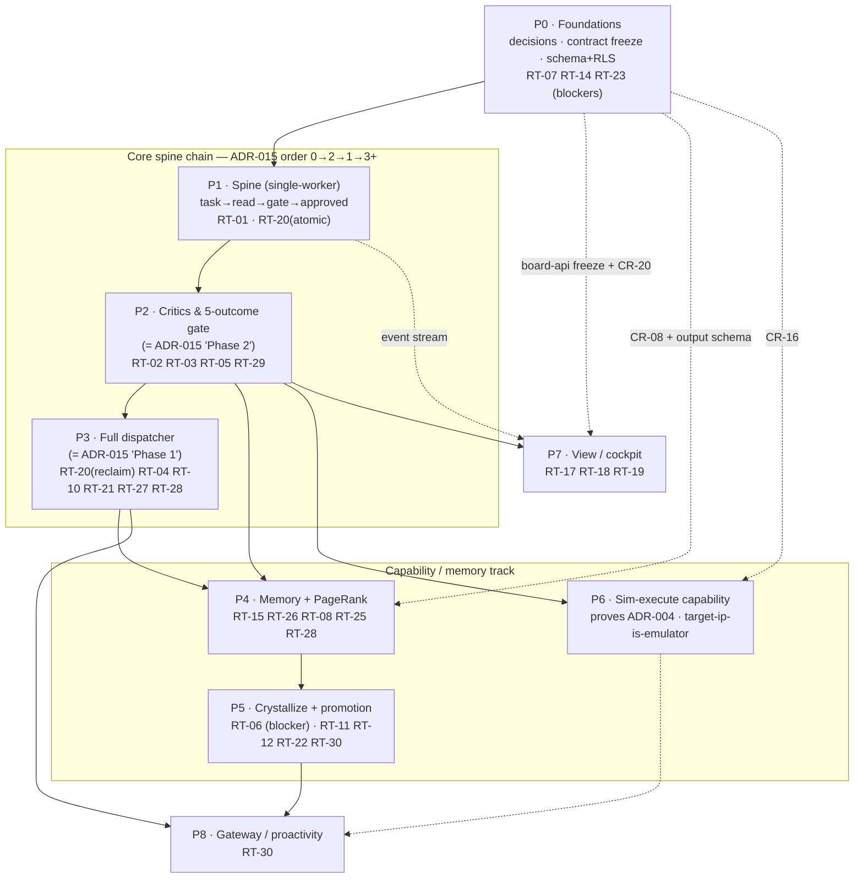

# TALOS — Build Sequence

> **What this is:** the dependency-ordered plan for *building* the settled TALOS design — what to build,
> in what order, what each phase delivers, and how each phase is verified before the next begins. It
> turns `02_unified_architecture.md` (the spine), `03_redteam_review.md` (the must-fix list), the 16
> ADRs, and the 4 frozen contracts into a build chain.
>
> **What this is not:** new architecture, and not a build. No implementation code, schema, or
> scaffolding is produced here — this orders the work. Every phase cites the ADR/contract it implements
> and the red-team IDs it closes.
>
> **Ordering authority:** ADR-015 (phase reorder) governs — **gate + critics land before the full
> distributed dispatcher**, implementation order `0 → 2 → 1 → 3+`, with `capability-manifest` frozen
> before the dispatcher exists (CR-23). Documentation phase-numbers and implementation phase-numbers are
> distinct axes (ADR-015 §22); this document numbers phases **P0…P8 in build order**.

---

## 0. Reading the sequence

The build is one **core spine chain** that must be sequential, plus higher-layer **capability and view
tracks** that branch off a known-good point and can run in parallel:

- **Core chain (sequential):** `P0 → P1 → P2 → P3`. This is ADR-015's reorder made concrete —
  foundations, then the single-worker spine, then critics + the five-outcome gate (together = ADR-015's
  "Phase 2"), then the full distributed dispatcher (ADR-015's "Phase 1").
- **Capability / memory track:** `P4` (memory + PageRank) → `P5` (crystallize + promotion) → `P6`
  (sim-execute capability). Branches off after P2/P3.
- **View track:** `P7` (cockpit) branches off after **board-api freezes in P0** and the **event stream
  exists in P1** — it is just another board-API consumer (ADR-002), so it can build in parallel from P2
  onward.
- **Proactivity track:** `P8` (gateway) is last; it inherits the full policy floor.

Every phase has a **Definition of Done** that is independently checkable (a test, an MCP/HTTP call, or a
named manual check) **before** the next phase in its chain starts.

---

## 1. Phase table

| Phase | Goal | Depends-on | Deliverables | Implements (ADR / contract) | Closes (RT) | Verification |
| :-- | :-- | :-- | :-- | :-- | :-- | :-- |
| **P0 — Foundations: decisions, contract freeze, schema & RLS** | Close every blocker that is a *decision or contract* before any runtime behavior exists; freeze the four contracts and stand up the Postgres system-of-record with isolation live. | — | New ADRs: **data-egress/residency** (RT-07), **runtime-engine license** (RT-23/RT-24), **PageRank** (CR-10/RT-26); ADR-016 promoted **Accepted** (RT-04). Frozen `board-api`, `capability-manifest` (dispositions **all 85** NEXUS tools, SoR-writers excluded), `nexus-federation` (node/edge/finding output schema), `widget-sandbox`. Postgres schema with **RLS enabled**; Redis channel-namespacing spec; manifest-validator; `thread_id↔attempt` mapping spec + attempt-independent idempotency-key spec. Human decisions recorded: **CR-08** (graph topology), **CR-16** (Rockwell sim path), **CR-20** (CSP set). | ADR-001/003/004/005/007/008/009/011/012/016; all 4 contracts; CR-08/16/20/23 | **RT-07, RT-14, RT-23** (blockers/major) · RT-09, RT-13, RT-15(freeze), RT-16(decide), RT-17(freeze), RT-20(spec), RT-24, RT-04 | Manifest-validator rejects a manifest exposing `tag_annotate`/`ingest_*`/`promote_raw_addresses_to_tags` (unit test). RLS-coverage test: every board-scoped table has an active policy; a cross-`board_id` SELECT returns 0 rows. Each contract file carries a frozen version tag. Each open-decision has a written ADR resolution. |
| **P1 — The spine (single-worker vertical slice)** | Prove the doctrine end-to-end on one worker: **one task → one NEXUS read (MCP) → trivial deliverable → authenticated human gate → approved**, with an idempotent post-gate side-effect. | P0 (schema+RLS, board-api, capability-manifest read profile, idempotency-key spec) | Minimal board engine (claim loop, no dispatcher); MCP read attachment to NEXUS (`tag_context`); one deterministic critic (`citations-resolvable`, minimal); pure gate node (`interrupt()`); idempotency-keyed post-gate side-effect node; authenticated human-session gate write. | ADR-001 (MCP read), ADR-002 (board-api), ADR-006 (ladder, minimal), ADR-009/010 (floor + session key), ADR-011 (Approve/Reject), `board-api`, `capability-manifest` | **RT-01** (blocker) · RT-16(live), **RT-20**(atomic post-gate half) | See **§4 First-phase detail** for full verification. Core: pytest spine test; live `tag_context` MCP call returns; non-human `submitGateOutcome` is rejected; replaying the post-gate node twice yields exactly one side effect. |
| **P2 — Critics & the five-outcome gate** | Complete the gate: deterministic critic library, all five outcomes, safety-class⇒non-waivable bound structurally, learned critics advisory-only, fail-closed citation path. | P1 | Critic registry (deterministic vs learned); safety-class→`waivable:false` binding + meta-critic build-fail; five gate outcomes (Approve/Reject/Waive/Edit-inline/Escalate); single-reviewer escalation policy; `citations-resolvable` fail-closed on NEXUS-unavailable; contradiction-finding rate-limit/dedupe before human queue. | ADR-011 (five outcomes, safety escalate-only), ADR-004/`capability-manifest` (safety flag), `nexus-federation` (confirmed-only citation), CR-06/CR-18/CR-26 | RT-02, RT-03, RT-05, RT-29 | Meta-critic test **fails the build** if any safety-class critic is waivable. Each outcome writes the correct `task_gate_results`/`tasks` columns (test). With NEXUS stubbed unavailable, a `confirmed`-citation deliverable is **blocked** (fail-closed test). Contradiction flood → queue receives deduped/rate-limited findings (test). |
| **P3 — Full distributed dispatcher** | Replace the single-worker harness with the real dispatcher (claim / heartbeat / breaker / checkpoint) and DAG scheduling, building *toward the already-proven gate*. | P2 (proven gate), P0 (`thread_id↔attempt` spec) | DAG-priority dispatcher (`ORDER BY on_critical_path DESC, priority DESC`); session-key worker isolation + Docker sandbox (`network:none`, `readOnlyRoot`); `thread_id↔attempt` reconciliation + reclaim; heartbeat-during-long-calls; commutative/associative multi-writer reducers; planner context per-`(board,session)` destroyed on scope switch; ADR-016 PM hooks + severity-gated escalator; engine snapshot/rollback. | ADR-010 (isolation), ADR-013 (coherence), ADR-016 (DAG/Gantt/dispatcher), CR-02/CR-12/CR-21 | **RT-20**(reclaim half), RT-04, RT-10, RT-21, RT-27, RT-28(engine) | Kill a worker mid-task → reclaim resumes from checkpoint with **no double-applied side effect** (idempotency test). Long capability call does not trip the >1h stale-reclaim (heartbeat test). Parallel workers writing a shared channel → deterministic state (reducer commutativity test). Scope-switch destroys planner context (test: board-A IP absent from board-B planner). Milestone risk: safety-significant → HIGH → **not** auto-dispatched (RT-04 test). |
| **P4 — Memory federation & PageRank triage** | Stand up the polyglot stores federated (not duplicated) to NEXUS, and the bounded PageRank context slice for triage. | P3, P0 (CR-08 decision, `nexus-federation` output schema, PageRank ADR) | Four stores wired (Postgres SoR, Neo4j+Graphiti, pgvector, Redis); `group_id` mediation chokepoint; NEXUS read-through over MCP (no duplication); bounded k-hop + node-budget PageRank (NetworkX) with **visible truncation** + min-coverage for safety edges; community/saga rollups pinned to one `group_id`; graph+vector snapshot/rollback (ported). | ADR-003 (four stores), ADR-007 (output contract), ADR-008 (vault topology), `nexus-federation`, CR-03/CR-07/CR-08/CR-10/CR-11 | RT-15(consume), RT-26, RT-08, RT-25, RT-28(graph+vector) | Episodic-vs-NEXUS contradiction becomes a **finding, not a memory write** (test). Cross-scope graph read returns nothing (isolation test). PageRank truncation renders **"N nodes dropped"** and never drops a flagged safety edge (canvas test). Rollup spanning `[client]+[shared]` is impossible (test). |
| **P5 — Crystallize & cross-client promotion** | Turn successful trajectories into gated skills/paths, and gate every `[client]→[shared]` promotion behind a deterministic de-identification critic. | P4, P2 (gate) | Crystallize step (post-gate, budget-bounded); **required, non-waivable `no-client-identifiers-in-shared` critic**; structurally-impossible cross-scope MERGE (candidate-set query cannot return mixed scopes); sensitivity classifier **fail-closed** on timeout/error; idempotent/atomic Graphiti ingestion (per-episode dedup key, all-or-nothing); edge learning-isolation decision (or sanitized gated push path). | ADR-005 (promotion gate), ADR-006 (crystallize), ADR-014 (consolidation), CR-04/CR-09/CR-25 | **RT-06** (blocker) · RT-11, RT-12, RT-22, RT-30 | Promotion carrying a client CH-number/tag-prefix is **blocked** by the de-id critic (test). Consolidation candidate-set query is structurally unable to return mixed scopes (query test). Classifier timeout ⇒ treated sensitive ⇒ gated (fail-closed test). Re-running crystallize ingestion creates **no duplicate** graph nodes (idempotency test). |
| **P6 — Sim-execute & codegen capability** | Exercise the write profile end-to-end and prove "write means sim only, never live": generate an offline artifact, run it against the emulator, gate the result. | P2 (gate), P0 (CR-16 decision); parallel to P3–P5 | Write-profile (`offline_artifact` / `sim_only`) execution path; `plc_test_bridge` with `sim_target` + **`target-ip-is-emulator` deterministic critic**; network-isolated sim run (OpenPLC / Emulate 5000 per CR-16); offline/sim-write iteration cap ≤1, no auto-retry on anything live. | ADR-004 (write=sim only), ADR-006 (execute step), `capability-manifest` (write_kind/safety/sim_target), CR-16 | (proves ADR-004 safety claim; no new RT, hardens RT-14 boundary) | A `sim_only` step whose target IP is **not** the emulator is **blocked** by `target-ip-is-emulator` (critic test). No tool can emit a live download/online-edit/tag-write (manifest-validator test). Sim run executes on the isolated emulator and returns results (integration test). |
| **P7 — View / cockpit (Space Agent board)** | Build the cockpit as a board-API consumer: Kanban/Gantt/risk heatmap, the five-outcome gate UI on the NEXUS review canvas, and gated agent-authored widgets. | P0 (board-api freeze, CR-20 CSP), P1 (event stream); parallel from P2 | Web Space Agent cockpit; least-privilege read projection (worker/credential columns hidden); gate UI with five outcomes + PageRank review canvas; two-gate human-count decision applied; widget lifecycle (propose→sandbox→critics→pin) with enumerated widget critic set incl. **non-waivable CSP/allowlist critic**; locked iframe + CSP + 4-type postMessage allowlist. | ADR-012 (web Space Agent), ADR-002 (board-as-Space), `board-api`, `widget-sandbox`, CR-20 | RT-17(live), RT-18, RT-19 | View cannot write `approved_at` except via the human gate path (test). Worker/credential columns never reach the projection (allowlist test). A widget cannot `submitGateOutcome`, fetch arbitrarily, or cross `board_id` (sandbox tests). A widget pins only after the CSP/allowlist critic passes (test). |
| **P8 — Gateway / proactivity** | Add sandboxed cron/heartbeat proactivity that may notify and propose but never approve, dispatch safety findings, or write live. | P2 (floor), P3 (dispatcher) | Cron/webhook loops (status digests, PM reminders, audit-freshness, deadline nudges); multi-channel notify; gateway sandboxed from live writes; same intersection-policy floor; rate-limit under three-axis budget. | ADR-009 (gateway floor), ROADMAP Phase 4, CR-19 | RT-30(push path, if any) | A proactive turn cannot set `approved_at` or auto-dispatch a safety finding (policy test). Gateway has no more privilege than a user turn (intersection-policy test). |

---

## 2. Dependency diagram



ASCII fallback:

```
P0 ──┬──────────────► P1 ─► P2 ─► P3 ───────────► P4 ─► P5 ─► P8
     │  (core spine chain: ADR-015  0→2→1→3+)      ▲      │
     │                                             │      │
     ├─ CR-08 + nexus-federation output schema ────┘      │
     ├─ CR-16 ───────────────► P6 (parallel P3–P5) ───────┘
     └─ board-api freeze + CR-20 ─► P7 (parallel from P2; needs P1 event stream)
```

---

## 3. Must-fix blocker closure — front-loaded and defended

The five BLOCKERs are not all closable in P0, because two require a capability to *exist* before they
can be enforced. The split below shows each is closed **at the earliest point it can be**, with the
precondition that makes earlier exposure impossible.

| Blocker | Kind | Closed in | Why not earlier — the precondition that holds until then |
| :-- | :-- | :-- | :-- |
| **RT-07** — air-gap vs DeepSeek egress | Decision / ADR | **P0** | Pure decision; written as a data-egress/residency ADR before any runtime exists. |
| **RT-14** — disposition all 85 NEXUS tools; exclude SoR-writers | Contract + validator | **P0** | `capability-manifest` freezes in P0 (CR-23) and the validator runs in CI from P0 — **no tool binds before the manifest gates it.** |
| **RT-20** — `thread_id↔attempt`; attempt-independent + atomic idempotency | Spec → enforce | **P0** (spec) · **P1** (atomic post-gate node) · **P3** (reclaim reconcile) | The split-brain manifests only on reclaim/resume. **No reclaim path exists before P3**, and P3 must not ship reclaim without the reconciliation; the atomic UNIQUE-constraint insert lands the moment the first side-effect node exists (P1). |
| **RT-01** — authenticated human gate write | Enforce at first gate write | **P1** | RT-01 cannot be "fixed" before a gate exists. **The gate's very first appearance (P1) already requires `approved_by` from an authenticated human session and rejects non-human `submitGateOutcome`** — there is no unauthenticated gate write at any point. |
| **RT-06** — non-waivable de-identification critic on promotion | Enforce at first promotion | **P5** | The leak vector is `[client]→[shared]` promotion. **No promotion path exists before P5** (default scope is `[client]`; nothing graduates without the gate). P5 ships the promotion gate and its de-id critic together — promotion never exists without it. |

**Standing CI invariants (inherited by every later phase, established P0):**

- **RLS-policy coverage (RT-09):** the "every board-scoped table has an active policy" test stays green
  as P4/P7 add tables; a new uncovered table **fails CI**.
- **Manifest validator (RT-14):** any later phase adding a tool runs the validator; exposing a
  NEXUS-fact-writing tool **fails CI**.
- **Idempotency (RT-20):** every post-gate side-effect carries a UNIQUE-constrained idempotency row in
  the same transaction as the effect.
- **No prose-only safety (CR-17):** every safety rule added later has a structural enforcer (critic,
  RLS, or tool-policy layer) — never AGENTS.md prose alone.

---

## 4. First-phase detail — P1, the smallest end-to-end vertical slice

> **Goal:** prove the spine with the least code that still routes through **both load-bearing
> boundaries** (the MCP edge and the human gate). One task, one NEXUS read, one human approval. No
> dispatcher, no memory consolidation, no write profile — those attach later. This is ADR-015's
> "single-worker harness is enough to prove the doctrine."

### The slice (one continuous path)

1. **Seed** one board + one task in Postgres with **RLS active** (`SET talos.board_id`). Task starts
   `ready`.
2. **Claim** — a single-worker loop (not the dispatcher) claims the task and mints session key
   `task:{board_id}:{task_id}:{attempt}` (scope only, not auth — CR-02).
3. **Read (MCP boundary)** — the worker makes **one** NEXUS read-profile call over MCP — `tag_context`
   — proving ADR-001's boundary and the `capability-manifest` read profile. NEXUS is read-through; the
   result is reference data, never persisted as TALOS truth (ADR-003/007).
4. **Deliverable** — the worker emits a trivial structured deliverable that **cites the NEXUS read**;
   task → `review`.
5. **Critic (deterministic)** — one critic, `citations-resolvable`, checks the cited NEXUS finding is
   `confirmed`-status (`nexus-federation`). Required-critic must pass.
6. **Gate (human, authenticated)** — pure node (`interrupt()` only). Human approves on an authenticated
   human-session; engine sets `approved_by` **from the session identity, never a request field**, and
   **rejects** any `submitGateOutcome` from a non-human caller (RT-01). Task cannot leave `review` until
   the required critic passes **and** `approved_at` is set.
7. **Post-gate side-effect (idempotent)** — a **separate** node persists the artifact + writes one audit
   episode + emits an event, all under a **UNIQUE-constrained idempotency row inserted in the same
   transaction** as the effect (RT-20, CR-12). Re-execution is a no-op.

### What P1 deliberately excludes

No full dispatcher (P3), no write/sim profile (P6), no PageRank/consolidation (P4/P5), no cockpit (P7).
The slice is read-only on the capability side — that is what keeps it the *smallest* spine proof.

### Reuse in P1 (see §5 ledger)

- **`api.py` read-only Starlette pattern** + **`board_queries` SELECT composition** → reuse-as-is for
  the read surface.
- **`nexus_critics.py::citations_resolvable`** → extend/port as the one P1 critic.
- **`db.py` findings-gate lifecycle** (`queued→proposed→confirmed`, no endpoint writes `confirmed`) →
  **pattern reference** for the TALOS gate — **reimplemented on Postgres**, not reused as SQLite code.

### Verification steps (all must pass before P2)

| # | Check | Type | Pass condition |
| :-- | :-- | :-- | :-- |
| 1 | Spine happy-path | pytest (engine) | task goes `ready → review → approved`; one audit episode; one event. |
| 2 | NEXUS read over MCP | live MCP call | `tag_context` returns a result through the MCP edge; nothing persisted as TALOS-owned truth. |
| 3 | **RT-01** — gate auth | manual + test | `submitGateOutcome` from a non-human / service caller is **rejected**; `approved_by` equals the authenticated session identity, not any request field. |
| 4 | **RT-20** — idempotency | test | running the post-gate node twice produces **exactly one** side effect (UNIQUE constraint hit, transaction atomic). |
| 5 | RLS isolation | test | a SELECT under board-A cannot read board-B's task (0 rows). |
| 6 | Critic gate | test | a deliverable citing a non-`confirmed` finding is **blocked**; task stays in `review`. |

---

## 5. Reuse vs. build-new ledger

Honest buckets: **reuse as-is** (drop-in pattern/code), **extend** (port + add), **replace / reference
only** (architecture differs; use as reference), **build new** (no precedent).

| Existing asset | Path | What it does | TALOS disposition |
| :-- | :-- | :-- | :-- |
| Read-only REST pattern | `nexus/nexus/api.py` | GET-only Starlette, `file:?mode=ro` SQLite, 7 endpoints | **Reuse as-is** (pattern) → TALOS NEXUS read-through / board-API read surface. |
| SELECT query core | `nexus/nexus/board_queries.py` | All read logic, `conn`-injected, no writes | **Reuse as-is** (pattern) → composition style for board-API reads. |
| Deterministic critic library | `nexus-agents/nexus_critics.py` | 7 critics (3 live + 4 fail-closed stubs), `run_all()` mandatory | **Extend** → port 3 live + 4 stubs; **add** `no-client-identifiers-in-shared` (RT-06, P5) and `target-ip-is-emulator` (P6); bind safety-class⇒non-waivable (RT-02). |
| Findings gate / lifecycle | `nexus/nexus/db.py` | `queued→proposed→confirmed`; no endpoint writes `confirmed`; `ratify-human`/`ratify-critic` | **Replace (reimplement pattern)** → the doctrine is the reference, but TALOS's engine is **Postgres**, not SQLite — reimplement the gate; do not import the code. |
| MCP tool surface | `nexus/nexus/mcp_server.py` | 85 tools, read-only except `generate_dox_tree` | **Extend** → `capability-manifest` must **disposition all 85**, exclude SoR-writers (RT-14); the tools themselves are reused behind MCP unchanged. |
| Format parsers | `nexus/nexus/parsers/*` | One parser per format; never write DB | **Reuse as-is** on the NEXUS side; TALOS couples to the **output contract** (ADR-007) — the coupling is new, the parsers are not touched. |
| Snapshot-before-write | `nexus-agents/_snapshot_db()` | Copies SQLite DB before write-class workflows; keeps last 7 | **Port (not reuse)** → RT-28: pattern is **not** carried to TALOS's polyglot stores; reimplement snapshot/rollback for Neo4j + pgvector (P3/P4). |
| Agent execution harness | `nexus-agents/agent_core.py` | LangChain agent over 85 MCP tools, DeepSeek, lazy imports | **Extend / reference** → model routing + MCP attachment pattern for the worker; lazy-import discipline kept. |
| Dashboard | `nexus-ui/*` (Next.js) | DB→API→UI read-only dashboard | **Replace / reference only** → cockpit is the **Space Agent** surface (ADR-012); reuse only the DB→API→UI shape as reference. |
| Read-only Node DB layer | `nexus-ui/src/lib/nexus-db.ts` | `getDb()` readonly; encodes columns directly | **Reference** → cautionary pattern (column renames break UI); informs board-api projection allowlist (RT-17). |
| LangGraph checkpointing | (nexus-agents dep) | Resumable workflow checkpoints | **Extend** → basis for `thread_id↔attempt` reconciliation (RT-20) and resumable cursor (P3). |
| — PageRank context slice | none | — | **Build new** → NetworkX k-hop + node-budget, visible truncation (RT-25/RT-26, P4). |
| — Gate node / critic registry | none | — | **Build new** → LangGraph `interrupt()` pure node + registry with safety-class binding (P1/P2). |
| — Polyglot federation + `group_id` chokepoint | none | — | **Build new** → four stores, mediation chokepoint, RLS (P0/P4). |
| — Manifest validator | none | — | **Build new** → rejects exposing any NEXUS-fact-writing tool (RT-14, P0). |

---

## 6. Open human-decisions assigned to phases (not resolved here)

This sequence **assigns** the still-open decisions to the phase that needs them; it does not make them
(per `03_redteam_review.md` "confirm it stays open").

| Decision | Owner phase (decide) | Applied in | Blocks |
| :-- | :-- | :-- | :-- |
| **CR-08** — separate Neo4j + NEXUS-MCP vs co-located label-scoped | P0 | P4 | `nexus-federation` freeze → memory phase |
| **CR-16** — Rockwell sim path (Logix Echo SDK / BOOL-forcing / ACD mod) + licensing | P0 | P6 | sim-execute capability |
| **CR-20** — exact CSP byte-set + bridge message semantics | P0 | P7 | widget pin |
| **RT-07** — self-host DeepSeek weights vs drop air-gap claim | P0 | P4/P8 (edge) | data-egress ADR |
| **RT-18** — two gate approvals vs one fused review | P0/P7 | P7 | gate UX |
| **RT-24** — Logix Echo SDK / gh-aw license terms | P0 | P6 | license ADR (stays open, tracked) |

---

## 7. Definition of done (whole sequence)

The build is complete when the phases form a clean dependency chain from "prove the spine" (P1) to "full
system" (P8); **every** `03_redteam_review.md` finding is closed in a named phase (blockers front-loaded
per §3); each phase's Definition of Done is independently verified before its successor starts; and
existing `nexus` / `nexus-agents` / `nexus-ui` assets are reused per §5 rather than rebuilt.
